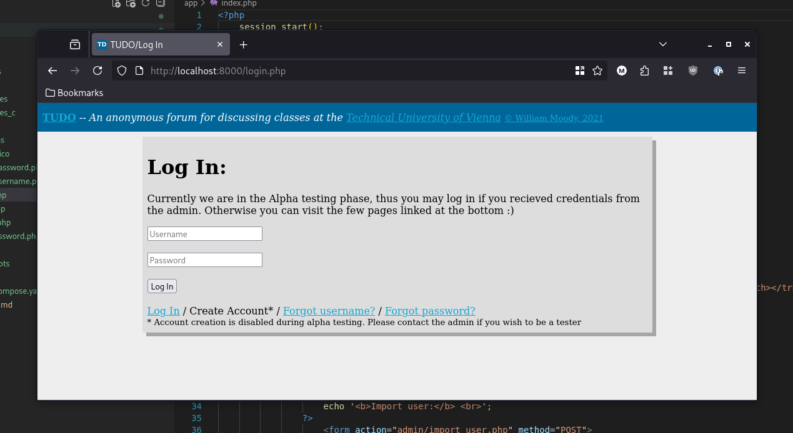
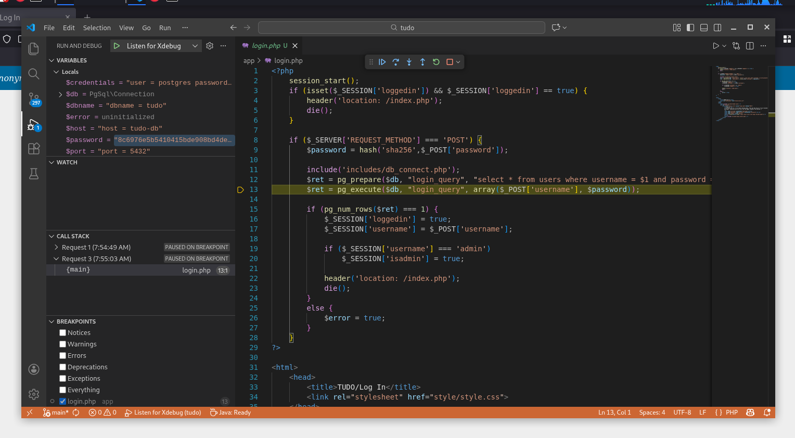

# TUDO &mdash; A Vulnerable PHP Web App

## Introduction

**TUDO** is an intentionally vulnerable web application that may be used to prepare for the **OSWE/AWAE** certification exam. Originally created in **March 2021**, many aspects of the challenge stopped working as the years went by, and so a major update was released in **December 2025** to address these. Everything works now, guaranteed!

## Challenge

There are **three steps** to complete the challenge, and multiple ways
to complete each step.

- **Authentication bypass:** Gain access to either `user1` or `user2`'s account (two possible ways).
- **Privilege escalation:** Gain access to the `admin` account (one possible way).
- **Remote code execution:** Find a way to remotely execute arbitrary commands (five possible ways &ndash; three of which were originally intended).

To make the most of **TUDO**, it is recommended to try and find all eight vulnerabilities, and to create a python script which chains three steps for a complete POC (_Hint: this is what they will require you to do on the exam_).

This challenge is intended to be treated like a **white-box penetration test**, so fire up [VS Code](https://github.com/microsoft/vscode), and read.

_Note: There is a cronjob emulating certain admin activity every minute._

_Note: To avoid spoilers, do not look inside the `docker` and `solutions` folders!_

## Credentials

You are provided with credentials for two standard users, as well as the administrator. _Remember, there are two possible authentication bypasses, so knowing these credentials is not necessary to "solve" TUDO. It does help to know which users exist though._

| Type          | Username | Password |
|---------------|----------|----------|
| Standard user | user1    | user1    |
| Standard user | user2    | user2    |
| Administrator | admin    | admin    |

## How to begin?

Clone the repository, and use [Docker Compose](https://docs.docker.com/compose/install/linux/) to launch the challenge:

```console
$ git clone https://github.com/bmdyy/tudo.git
$ cd tudo
$ docker compose up -d
```

The target will be accessible at [http://localhost:8000](http://localhost:8000).



To stop the challenge, run:

```console
$ docker compose down
```

If you need to reset the challenge, run this while the containers are down:

```console
$ docker system prune -f
```

_Good luck!_

### PHP remote debugging

The challenge is already set up for remote debugging using [Xdebug](https://xdebug.org/) and [VS Code](https://code.visualstudio.com/). Assuming you opened the **root folder** in Code and not **app**, simply hit `[F5]` to start debugging.



_Note: If for some reason your host machine's Docker IP is **not** `172.17.0.1`, make sure to update `hostname` in `.vscode/launch.json`_

### Viewing PostgreSQL query log

All PgSQL queries are automatically written to the database container's log file. To view it, run the following command:

```console
$ docker logs -f tudo-db
```

### Interacting with the database

You can interact with the PostgreSQL database via `psql` with the following command:

```console
$ docker exec -it tudo-db psql -U postgres tudo
psql (18.1 (Debian 18.1-1.pgdg13+2))
Type "help" for help.

tudo=# \dt
             List of tables
 Schema |    Name     | Type  |  Owner   
--------+-------------+-------+----------
 public | class_posts | table | postgres
 public | motd_images | table | postgres
 public | tokens      | table | postgres
 public | users       | table | postgres
(4 rows)
```

## Solutions

There are POCs and explanations for all the various ways to solve **TUDO** in [solutions](solutions/).
